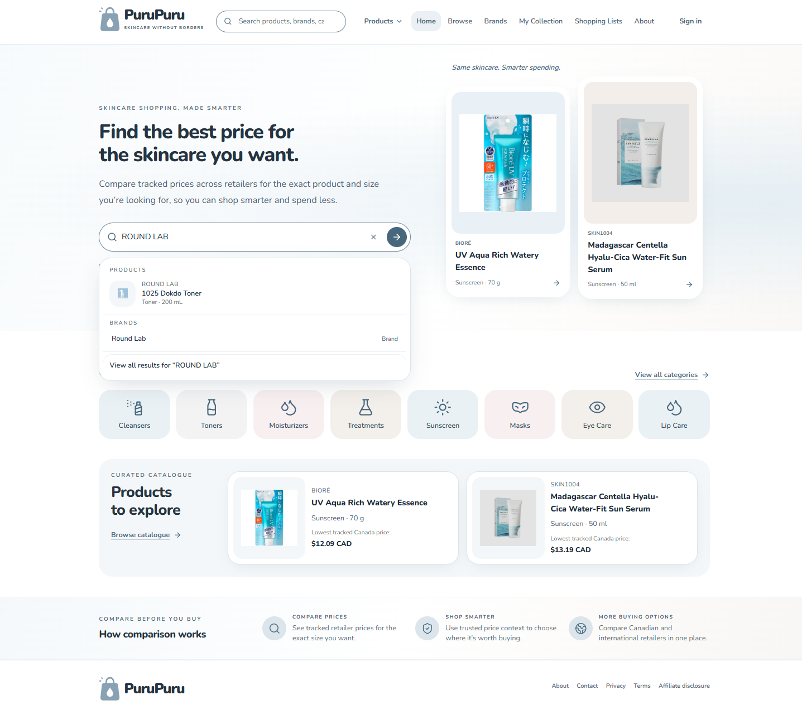
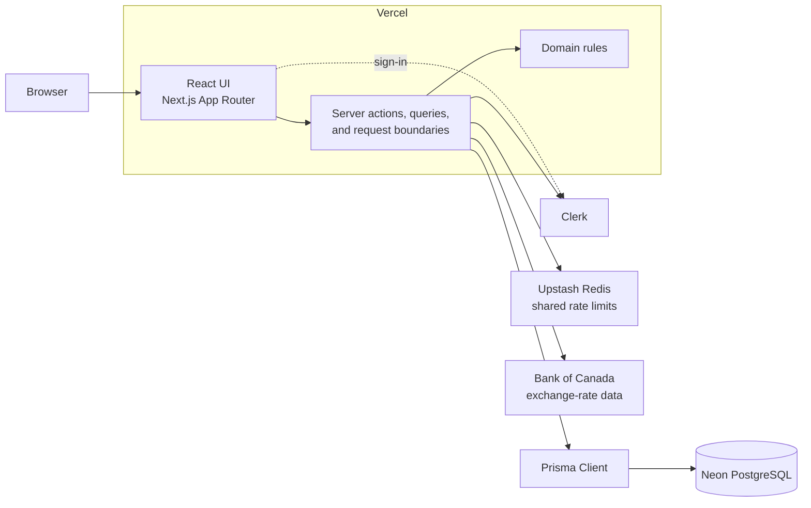
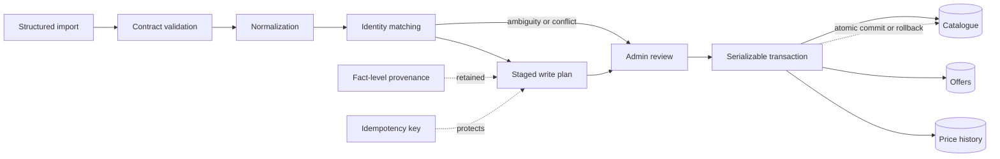

# PuruPuru

PuruPuru is a skincare price-comparison platform that helps shoppers compare retailer prices for the exact product and size they want, identify the best tracked buying option, and save money.

**Live application:** [purupuru.ca](https://www.purupuru.ca/)

## Tech stack

| Area | Technologies |
| --- | --- |
| Frontend | Next.js 15, React 19, TypeScript, Tailwind CSS, shadcn/ui conventions, Lucide icons |
| Application layer | Next.js App Router, server components, server actions, runtime input validation |
| Data | PostgreSQL, Prisma, Neon |
| Authentication and infrastructure | Clerk, Upstash Redis, Vercel |
| External data | Bank of Canada exchange-rate data |
| Tooling | pnpm workspaces, ESLint, Node test runner |

## Engineering highlights

- **Variant-level catalogue:** each purchasable size is independently browsable, filterable, linkable, and price-comparable without duplicating product identity.
- **Normalized capacity filtering:** compatible volume or mass units are normalized for filtering while incompatible dimensions remain separate.
- **Market-aware price comparison:** offers retain native currency, availability, and explicit customer markets; Canadian shoppers receive approximate CAD presentation without replacing the source price.
- **Structured commerce model:** PostgreSQL and Prisma model product families, meaningful versions, exact-size variants, retailers, offers, benchmark prices, and historical observations separately.
- **Reviewed ingestion pipeline:** versioned imports pass runtime validation, normalization, provenance capture, and conservative identity matching before an administrator can approve a write plan.
- **Safe catalogue writes:** idempotency keys, stable retailer identities, serializable transactions, stale-plan revalidation, and atomic rollback prevent duplicate or partial product graphs.
- **Private user data:** Clerk identities resolve to local users, and collection, rating, purchase, and shopping-list reads and mutations enforce ownership.
- **Boundary-focused quality:** 159 automated tests cover domain invariants, ingestion behavior, authorization and security boundaries, missing-data semantics, and structural UX contracts.

## Why I built it

Skincare products are often sold by several domestic and international retailers, but comparing them is difficult because listings vary by size, currency, availability, packaging, and naming. I built PuruPuru to normalize listings around the product and size a shopper actually wants, then make the tracked buying options easy to compare.

## Architecture

Public catalogue reads do not require authentication. Private operations resolve the verified Clerk identity to a local user, while domain rules remain separate from React and Prisma so they can be tested directly.

## Product ingestion architecture

Import submissions never publish automatically. Ambiguous identity remains visible for review, and approval revalidates the plan inside the same atomic transaction that writes catalogue records, offers, and price observations.

## Interesting engineering decisions

- **Browse variants, search families:** catalogue rows represent exact purchasable variants, while search and autocomplete avoid flooding results with every size.
- **Size is the normal shopper-facing distinction:** `ProductVersion` remains an internal exception for formula or release differences that materially affect a purchase.
- **Native currency is authoritative:** CAD conversion is presentation-only and can fail without hiding or rewriting the original price.
- **Ranking is affiliate-neutral:** tracked product price determines default ordering; commissions and opaque “best deal” scores do not.
- **Uncertainty is explicit:** low-confidence imports become review outcomes instead of silently creating or merging catalogue identity.

## Testing and quality

The repository currently has **159 automated tests** covering pure domain rules, ingestion planning and transaction behavior, ownership and security boundaries, offer and benchmark semantics, and source-level UX contracts. The normal verification pass also includes linting, workspace typechecking, Prisma validation/generation, dependency auditing, and a production build.

The suite is intentionally strongest around invariants and failure cases. Source-contract tests and narrow DOM stand-ins are not presented as comprehensive browser E2E or accessibility certification.

For implementation detail, see the [architecture](docs/ARCHITECTURE.md), [data model](docs/DATA_MODEL.md), [ingestion design](docs/INGESTION.md), and [testing approach](docs/TESTING.md).

---

Source code is publicly viewable for portfolio and evaluation purposes. All rights reserved.
