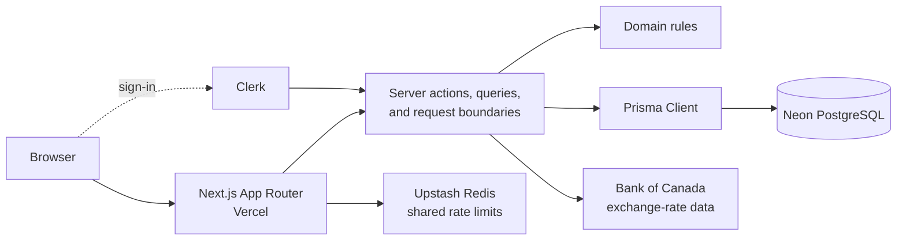
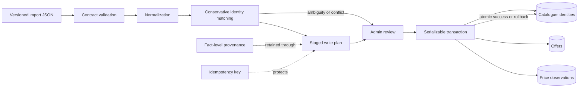

# PuruPuru

PuruPuru helps shoppers compare available retailer prices for the exact skincare product and size they want, identify the best tracked buying option, and save money.

**Live site:** [purupuru.ca](https://www.purupuru.ca/)

> Screenshot coming soon. The repository does not currently include a cleared, durable product screenshot.

## Why this project is interesting

- Full-stack Next.js, React, and TypeScript monorepo with explicit domain, persistence, server, and presentation boundaries.
- Normalized PostgreSQL/Prisma model for product families, meaningful versions, exact-size variants, retailer offers, benchmarks, and price observations.
- Variant-level, market-aware retailer comparisons with normalized capacity filtering and honest missing-price states.
- Native-currency price storage with approximate CAD presentation using Bank of Canada exchange-rate data.
- Versioned staged ingestion with runtime validation, provenance, conservative identity matching, and human review.
- Idempotent ingestion and serializable, atomic catalogue commits that reject ambiguous or stale plans.
- Clerk-backed authorization and strict user isolation for private collections and shopping lists.
- Price history and 150+ invariant-focused automated tests covering domain, security, ingestion, and UI contracts.

## Architecture



Public catalogue reads remain independent of authentication. Private actions resolve the verified Clerk identity to a local user and scope every read and write by ownership. Domain rules stay outside React and Prisma so the same invariants can be tested directly.

### Staged catalogue ingestion



Submitted data never publishes automatically. The server revalidates and replans at approval time, and an ambiguity remains a review outcome rather than silently creating or merging catalogue identity.

## Technology

- Next.js 15, React 19, TypeScript
- Tailwind CSS and reusable UI components
- PostgreSQL, Prisma, Neon
- Clerk authentication
- Upstash Redis rate limiting
- Vercel deployment
- pnpm workspaces

## Repository structure

```text
apps/web/                 Next.js application, server actions, and query layer
packages/database/        Prisma schema, migrations, seed, and shared client
packages/domain/          Pure domain rules and ingestion contracts
packages/ui/              Shared presentation primitives
data/                     Curated seed data and local ingestion fixtures
scripts/import/           Developer-operated ingestion CLI
scripts/verify/           Database and security verification tools
tests/domain/             Invariant-focused Node test suite
docs/                     Product, architecture, data, UX, and ingestion docs
```

## Local development

### Prerequisites

- Node.js 22 LTS (see `.nvmrc`)
- pnpm 11.19.0, declared in `package.json`
- A PostgreSQL database; Neon is used by the deployed application

External services are deliberately separate:

- **PostgreSQL/Neon:** required for catalogue and personal-data reads and writes.
- **Clerk:** required for sign-in and private/admin actions; anonymous catalogue browsing remains public.
- **Upstash Redis:** required for shared production rate limits. Local development may run without it when both Upstash variables are omitted.

### Environment

Copy `.env.example` to both locations below, then replace placeholders with development credentials:

```text
apps/web/.env.local
packages/database/.env
```

The web environment needs Clerk and database variables. Prisma CLI commands read the database variables from `packages/database/.env`. Admin and Upstash variables are server-only and must never use a `NEXT_PUBLIC_` prefix. Real environment files are ignored by Git.

### Install and prepare the database

```bash
pnpm install --frozen-lockfile
pnpm db:generate
pnpm db:migrate:deploy
pnpm db:seed
```

`db:migrate:deploy` applies the repository's reviewed migrations without generating a new one. Use a disposable development database when evaluating the project.

### Run the app

```bash
pnpm dev
```

The primary public routes are `/`, `/catalogue`, `/categories/[slug]`, and `/products/[slug]`. Signed-in users also have private collection and shopping-list routes.

## Verification

```bash
pnpm test          # deterministic domain and source-contract tests
pnpm lint          # web linting
pnpm typecheck     # workspace TypeScript checks
pnpm db:validate   # Prisma schema validation
pnpm db:generate   # regenerate Prisma Client
pnpm build         # production Next.js build
```

When a configured development database is available, `pnpm ingest:verify` performs rollback-only database checks for ingestion identity, idempotency, price changes, and cleanup. Source-contract and narrow DOM-stand-in tests do not replace browser E2E or manual accessibility QA; see [Testing](docs/TESTING.md).

## Deployment

The web application is deployed to Vercel, which generates Prisma Client on its Linux build environment before `next build`. Neon supplies pooled and direct PostgreSQL connections, Clerk supplies authentication, and Upstash supplies shared production rate limiting. Schema changes are applied through reviewed Prisma migrations rather than deployment-provider schema tools.

No production identifiers or credentials belong in this repository. Deployment values are configured in provider-managed environment settings.

## Data-integrity principles

- Shopper-facing identity is normally brand, product name, and exact size.
- The canonical chain remains `ProductFamily → ProductVersion → ProductVariant → Offer`; meaningful versions and exact variants are never silently merged.
- Retailer input is normalized and conservatively matched before it can affect canonical data.
- Native price and provenance remain authoritative; currency conversions are approximate presentation values.
- MSRP, Retail Price, and Reference Price have distinct meanings, and missing prices are never treated as zero.
- Default offer ordering uses product price, not affiliate relationships, shipping, or opaque deal scores.
- Private reads and mutations are scoped to the authenticated local user.

## Documentation

- [Product specification](PRODUCT_SPEC_V0.md)
- [Architecture](docs/ARCHITECTURE.md)
- [Data model](docs/DATA_MODEL.md)
- [Decisions](docs/DECISIONS.md)
- [Design principles](docs/DESIGN_PRINCIPLES.md)
- [UX specification](docs/UX_SPEC.md)
- [User flows](docs/USER_FLOWS.md)
- [Ingestion](docs/INGESTION.md)
- [Testing](docs/TESTING.md)
- [Roadmap](docs/ROADMAP.md)
- [Security policy](SECURITY.md)

`AGENTS.md` contains the repository's engineering and data-integrity guardrails for coding agents and maintainers.

## License

This repository is publicly viewable for portfolio and recruiter evaluation purposes. All rights are reserved. Copying, modification, distribution, or reuse of the source code or project assets requires explicit permission from the author.
